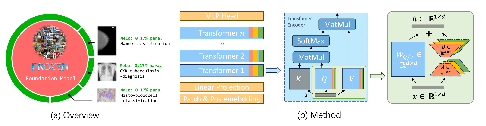

# MeLo: Low-rank Adaptation is Better than Finetuning for Medical Image



## Useful links

<div align="center">
    <a href="https://absterzhu.github.io/melo.github.io/" class="button"><b>[Homepage]</b></a> &nbsp;&nbsp;&nbsp;&nbsp;
    <a href="https://arxiv.org/abs/2311.08236" class="button"><b>[arXiv]</b></a> &nbsp;&nbsp;&nbsp;&nbsp;
</div>

## Feature
- [x] Supported DeepLab segmentation for ```lukemelas/PyTorch-Pretrained-ViT```. 2023-03-15
- [x] Supported ```timm```. 2023-03-16
- [x] Supported ```multi-lora```. 2023-11-15
- [ ] Repo clean up.

## Installation
Gii clone. My ```torch.__version__==1.13.0```, other version newer than ```torch.__version__==1.10.0``` should also work, I guess.
You may also need a ```safetensors``` from huggingface to load and save weight.

## Examples
You may find examples in ```examples.ipynb```

## Usage
You may use Vision Transformer from ```timm```:
```python
import timm
import torch
from lora import LoRA_ViT_timm
img = torch.randn(2, 3, 224, 224)
model = timm.create_model('vit_base_patch16_224', pretrained=True)
lora_vit = LoRA_ViT_timm(vit_model=model, r=4, num_classes=10)
pred = lora_vit(img)
print(pred.shape)
```

If timm is too complicated, you can use a simpler implementation of ViT from ```lukemelas/PyTorch-Pretrained-ViT```.
Wrap you ViT using LoRA-ViT, this a simple example of classifer
```python
from base_vit import ViT
import torch
from lora import LoRA_ViT

model = ViT('B_16_imagenet1k')
model.load_state_dict(torch.load('B_16_imagenet1k.pth'))
preds = model(img) # preds.shape = torch.Size([1, 1000])

num_params = sum(p.numel() for p in model.parameters() if p.requires_grad)
print(f"trainable parameters: {num_params}") #trainable parameters: 86859496


lora_model = LoRA_ViT(model, r=4, num_classes=10)
num_params = sum(p.numel() for p in lora_model.parameters() if p.requires_grad)
print(f"trainable parameters: {num_params}") # trainable parameters: 147456

```

this an example for segmentation tasks, using deeplabv3
```python
model = ViT('B_16_imagenet1k')
model.load_state_dict(torch.load('B_16_imagenet1k.pth'))
lora_model = LoRA_ViT(model, r=4)
seg_lora_model = SegWrapForViT(vit_model=lora_model, image_size=384,
                            patches=16, dim=768, n_classes=10)

num_params = sum(p.numel() for p in seg_lora_model.parameters() if p.requires_grad)
print(f"Number of trainable parameters: {num_params/2**20:.3f}") # trainable parameters: 6.459
```

Save and load LoRA:
```python
lora_model.save_lora_parameters('mytask.lora.safetensors') # save
lora_model.load_lora_parameters('mytask.lora.safetensors') # load
```

## Performance
In M1 Pro, LoRA is about 1.8x~1.9x faster.
```python performance_profile.py``` should do the time profiler now. More test will come soon.

## Citation
Use this bibtex to cite this repository:
```
@misc{zhu2023melo,
      title={MeLo: Low-rank Adaptation is Better than Fine-tuning for Medical Image Diagnosis}, 
      author={Yitao Zhu and Zhenrong Shen and Zihao Zhao and Sheng Wang and Xin Wang and Xiangyu Zhao and Dinggang Shen and Qian Wang},
      year={2023},
      eprint={2311.08236},
      archivePrefix={arXiv},
      primaryClass={cs.CV}
}
```

## Credit
ViT code and imagenet pretrained weight come from ```lukemelas/PyTorch-Pretrained-ViT```